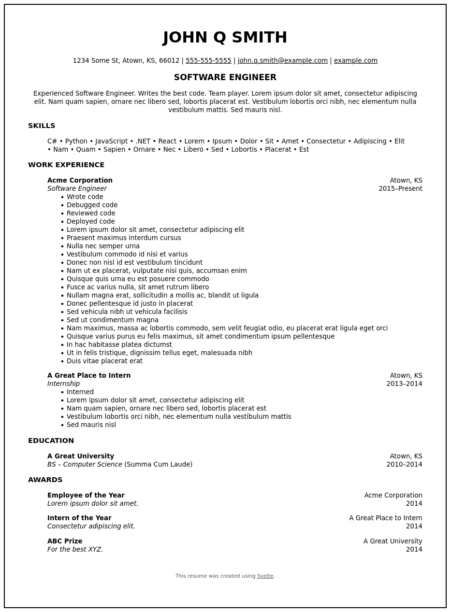

# Resume (Svelte)
A very basic resume-builder, written in [Svelte]. Features:
- Store your resume in JSON.
- Style with CSS.
- Easily extend with additional Svelte components.
- Print to PDF from your browser.

## Usage
Start the server in dev mode:
```console
$ npm run dev
```
- Copy and rename [example.json] under `src/assets/resume`. This file will
  be used to store your resume data.
- Update `import resume` [`App.svelte`](src/App.svelte) to reference the new
  JSON file.
- Make changes to your JSON data.
- Edit styles in `src/assets/css/theme.css`.
- View your resume at http://localhost:3000. Whenever you save a change, the
  browser will automatically update.
- When you are satisfied with the results, print from the browser.

> [!NOTE]
> Personal resume data is not stored in this repository. It is recommended to
> store this data in a separate location.

## Example
See [example.json] and [example.pdf].



<!------------------------------------------------------------------------------
  Links
------------------------------------------------------------------------------->
[example.json]: src/assets/resume/example.json
[example.pdf]: public/pdf/example-resume.pdf
[Svelte]: https://svelte.dev
